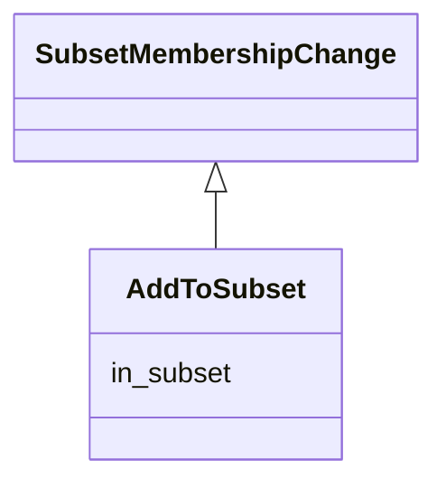

# Class: AddToSubset
_placing an element inside a subset_


* __NOTE__: this is a mixin class intended to be used in combination with other classes, and not used directly


URI: [kgcl_schema:AddToSubset](https://w3id.org/kgcl-schema/AddToSubset)





## Inheritance
* [ChangeMixin](ChangeMixin.md)
    * [SubsetMembershipChange](SubsetMembershipChange.md)
        * **AddToSubset**


## Slots

| Name | Cardinality and Range  | Description  |
| ---  | ---  | --- |
| [in_subset](in_subset.md) | 0..1 <br/> [OntologySubset](OntologySubset.md)  | subset that the element is being placed inside  |


## Usages


| used by | used in | type | used |
| ---  | --- | --- | --- |
| [RemovedNodeFromSubset](RemovedNodeFromSubset.md) | [has_undo](has_undo.md) | range | add to subset |


## Identifier and Mapping Information


### Schema Source


* from schema: https://w3id.org/hrshdhgd/kgcl-schema


## Mappings

| Mapping Type | Mapped Value |
| ---  | ---  |
| self | ['kgcl_schema:AddToSubset'] |
| native | ['kgcl_schema:AddToSubset'] |


## LinkML Specification

<!-- TODO: investigate https://stackoverflow.com/questions/37606292/how-to-create-tabbed-code-blocks-in-mkdocs-or-sphinx -->

### Direct

<details>
```yaml
name: add to subset
description: placing an element inside a subset
from_schema: https://w3id.org/hrshdhgd/kgcl-schema
rank: 1000
is_a: subset membership change
mixin: true
slot_usage:
  in subset:
    name: in subset
    description: subset that the element is being placed inside.
    domain_of:
    - subset membership change
    - subset membership change

```
</details>

### Induced

<details>
```yaml
name: add to subset
description: placing an element inside a subset
from_schema: https://w3id.org/hrshdhgd/kgcl-schema
rank: 1000
is_a: subset membership change
mixin: true
slot_usage:
  in subset:
    name: in subset
    description: subset that the element is being placed inside.
    domain_of:
    - subset membership change
    - subset membership change
attributes:
  in subset:
    name: in subset
    description: subset that the element is being placed inside.
    from_schema: https://w3id.org/hrshdhgd/kgcl-schema
    rank: 1000
    alias: in_subset
    owner: add to subset
    domain_of:
    - subset membership change
    - subset membership change
    range: ontology subset

```
</details>