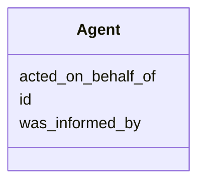

# Class: Agent
_a provence-generating agent_


URI: [prov:Agent](http://www.w3.org/ns/prov#Agent)





<!-- no inheritance hierarchy -->


## Slots

| Name | Cardinality and Range  | Description  |
| ---  | ---  | --- |
| [id](id.md) | 1..1 <br/> [xsd:string](xsd:string)  |   |
| [acted_on_behalf_of](acted_on_behalf_of.md) | 0..1 <br/> [Agent](Agent.md)  |   |
| [was_informed_by](was_informed_by.md) | 0..1 <br/> [Activity](Activity.md)  |   |


## Usages


| used by | used in | type | used |
| ---  | --- | --- | --- |
| [Activity](Activity.md) | [was_associated_with](was_associated_with.md) | range | agent |
| [Agent](Agent.md) | [acted_on_behalf_of](acted_on_behalf_of.md) | range | agent |


## Identifier and Mapping Information


### Schema Source


* from schema: https://w3id.org/kgcl_schema/prov


## Mappings

| Mapping Type | Mapped Value |
| ---  | ---  |
| self | ['prov:Agent'] |
| native | ['prov:Agent'] |


## LinkML Specification

<!-- TODO: investigate https://stackoverflow.com/questions/37606292/how-to-create-tabbed-code-blocks-in-mkdocs-or-sphinx -->

### Direct

<details>
```yaml
name: agent
description: a provence-generating agent
from_schema: https://w3id.org/kgcl_schema/prov
rank: 1000
slots:
- id
- acted on behalf of
- was informed by
class_uri: prov:Agent

```
</details>

### Induced

<details>
```yaml
name: agent
description: a provence-generating agent
from_schema: https://w3id.org/kgcl_schema/prov
rank: 1000
attributes:
  id:
    name: id
    from_schema: https://w3id.org/kgcl_schema/basics
    rank: 1000
    identifier: true
    alias: id
    owner: agent
    domain_of:
    - change
    - activity
    - agent
    - node
    range: string
  acted on behalf of:
    name: acted on behalf of
    from_schema: https://w3id.org/kgcl_schema/prov
    rank: 1000
    slot_uri: prov:actedOnBehalfOf
    alias: acted_on_behalf_of
    owner: agent
    domain_of:
    - agent
    range: agent
  was informed by:
    name: was informed by
    from_schema: https://w3id.org/kgcl_schema/prov
    rank: 1000
    slot_uri: prov:wasInformedBy
    alias: was_informed_by
    owner: agent
    domain_of:
    - activity
    - agent
    range: activity
class_uri: prov:Agent

```
</details>