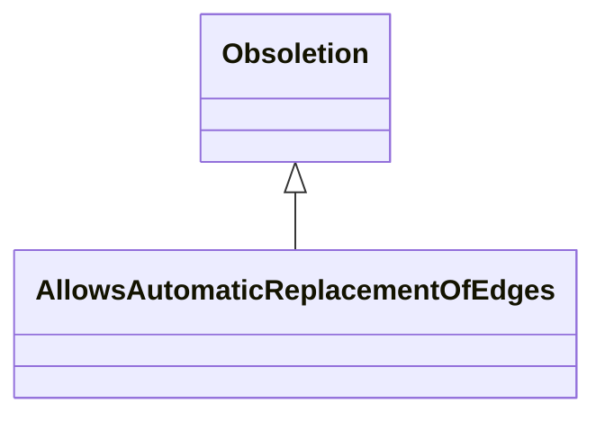

# Class: AllowsAutomaticReplacementOfEdges
_Applies to an obsoletion in which annotations or edges pointing at the obsoleted node can be automatically rewired to point to a target_


* __NOTE__: this is a mixin class intended to be used in combination with other classes, and not used directly


URI: [kgcl_schema:AllowsAutomaticReplacementOfEdges](https://w3id.org/kgcl-schema/AllowsAutomaticReplacementOfEdges)





## Inheritance
* [ChangeMixin](ChangeMixin.md)
    * [Obsoletion](Obsoletion.md)
        * **AllowsAutomaticReplacementOfEdges**


## Slots

| Name | Cardinality and Range  | Description  |
| ---  | ---  | --- |


## Usages


## Identifier and Mapping Information


### Schema Source


* from schema: https://w3id.org/hrshdhgd/kgcl-schema


## Mappings

| Mapping Type | Mapped Value |
| ---  | ---  |
| self | ['kgcl_schema:AllowsAutomaticReplacementOfEdges'] |
| native | ['kgcl_schema:AllowsAutomaticReplacementOfEdges'] |


## LinkML Specification

<!-- TODO: investigate https://stackoverflow.com/questions/37606292/how-to-create-tabbed-code-blocks-in-mkdocs-or-sphinx -->

### Direct

<details>
```yaml
name: allows automatic replacement of edges
description: Applies to an obsoletion in which annotations or edges pointing at the
  obsoleted node can be automatically rewired to point to a target
from_schema: https://w3id.org/hrshdhgd/kgcl-schema
rank: 1000
is_a: obsoletion
mixin: true

```
</details>

### Induced

<details>
```yaml
name: allows automatic replacement of edges
description: Applies to an obsoletion in which annotations or edges pointing at the
  obsoleted node can be automatically rewired to point to a target
from_schema: https://w3id.org/hrshdhgd/kgcl-schema
rank: 1000
is_a: obsoletion
mixin: true

```
</details>