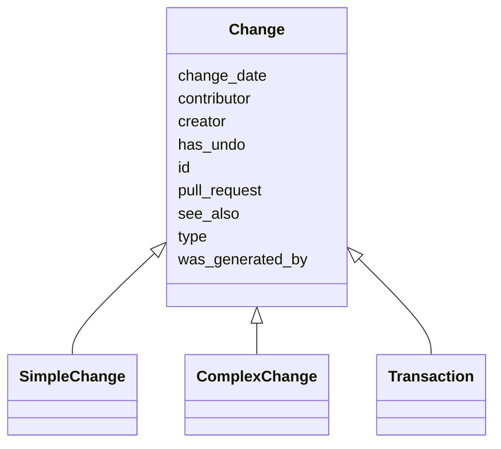

# Class: Change
_Any change perform on an ontology or knowledge graph_


* __NOTE__: this is an abstract class and should not be instantiated directly


URI: [kgcl_schema:Change](https://w3id.org/kgcl-schema/Change)





## Inheritance
* **Change**
    * [SimpleChange](SimpleChange.md)
    * [ComplexChange](ComplexChange.md)
    * [Transaction](Transaction.md)


## Slots

| Name | Cardinality and Range  | Description  |
| ---  | ---  | --- |
| [id](id.md) | 1..1 <br/> [xsd:string](xsd:string)  |   |
| [type](type.md) | 0..1 <br/> [xsd:string](xsd:string)  |   |
| [was_generated_by](was_generated_by.md) | 0..1 <br/> [Activity](Activity.md)  |   |
| [see_also](see_also.md) | 0..1 <br/> [xsd:string](xsd:string)  |   |
| [pull_request](pull_request.md) | 0..1 <br/> [xsd:string](xsd:string)  |   |
| [creator](creator.md) | 0..1 <br/> [xsd:string](xsd:string)  |   |
| [change_date](change_date.md) | 0..1 <br/> [xsd:string](xsd:string)  |   |
| [contributor](contributor.md) | 0..1 <br/> [xsd:string](xsd:string)  |   |
| [has_undo](has_undo.md) | 0..1 <br/> [Change](Change.md)  | A change that reverses this change  |


## Usages


| used by | used in | type | used |
| ---  | --- | --- | --- |
| [Change](Change.md) | [has_undo](has_undo.md) | domain | change |
| [Change](Change.md) | [has_undo](has_undo.md) | range | change |
| [SimpleChange](SimpleChange.md) | [has_undo](has_undo.md) | domain | change |
| [SimpleChange](SimpleChange.md) | [has_undo](has_undo.md) | range | change |
| [ComplexChange](ComplexChange.md) | [change_set](change_set.md) | range | change |
| [ComplexChange](ComplexChange.md) | [has_undo](has_undo.md) | domain | change |
| [ComplexChange](ComplexChange.md) | [has_undo](has_undo.md) | range | change |
| [MultiNodeObsoletion](MultiNodeObsoletion.md) | [has_undo](has_undo.md) | domain | change |
| [MultiNodeObsoletion](MultiNodeObsoletion.md) | [has_undo](has_undo.md) | range | change |
| [Transaction](Transaction.md) | [change_set](change_set.md) | range | change |
| [Transaction](Transaction.md) | [has_undo](has_undo.md) | domain | change |
| [Transaction](Transaction.md) | [has_undo](has_undo.md) | range | change |
| [EdgeChange](EdgeChange.md) | [has_undo](has_undo.md) | domain | change |
| [EdgeChange](EdgeChange.md) | [has_undo](has_undo.md) | range | change |
| [EdgeCreation](EdgeCreation.md) | [has_undo](has_undo.md) | domain | change |
| [PlaceUnder](PlaceUnder.md) | [has_undo](has_undo.md) | domain | change |
| [EdgeDeletion](EdgeDeletion.md) | [has_undo](has_undo.md) | domain | change |
| [EdgeDeletion](EdgeDeletion.md) | [has_undo](has_undo.md) | range | change |
| [RemoveUnder](RemoveUnder.md) | [has_undo](has_undo.md) | domain | change |
| [RemoveUnder](RemoveUnder.md) | [has_undo](has_undo.md) | range | change |
| [EdgeObsoletion](EdgeObsoletion.md) | [has_undo](has_undo.md) | domain | change |
| [EdgeRewiring](EdgeRewiring.md) | [has_undo](has_undo.md) | domain | change |
| [EdgeRewiring](EdgeRewiring.md) | [has_undo](has_undo.md) | range | change |
| [MappingCreation](MappingCreation.md) | [has_undo](has_undo.md) | domain | change |
| [NodeMove](NodeMove.md) | [has_undo](has_undo.md) | domain | change |
| [NodeMove](NodeMove.md) | [has_undo](has_undo.md) | range | change |
| [NodeDeepening](NodeDeepening.md) | [has_undo](has_undo.md) | domain | change |
| [NodeDeepening](NodeDeepening.md) | [has_undo](has_undo.md) | range | change |
| [NodeShallowing](NodeShallowing.md) | [has_undo](has_undo.md) | domain | change |
| [NodeShallowing](NodeShallowing.md) | [has_undo](has_undo.md) | range | change |
| [PredicateChange](PredicateChange.md) | [has_undo](has_undo.md) | domain | change |
| [PredicateChange](PredicateChange.md) | [has_undo](has_undo.md) | range | change |
| [EdgeLogicalInterpretationChange](EdgeLogicalInterpretationChange.md) | [has_undo](has_undo.md) | domain | change |
| [EdgeLogicalInterpretationChange](EdgeLogicalInterpretationChange.md) | [has_undo](has_undo.md) | range | change |
| [LogicalAxiomChange](LogicalAxiomChange.md) | [has_undo](has_undo.md) | domain | change |
| [LogicalAxiomChange](LogicalAxiomChange.md) | [has_undo](has_undo.md) | range | change |
| [NodeChange](NodeChange.md) | [has_undo](has_undo.md) | domain | change |
| [NodeChange](NodeChange.md) | [has_undo](has_undo.md) | range | change |
| [NodeRename](NodeRename.md) | [has_textual_diff](has_textual_diff.md) | domain | change |
| [NodeRename](NodeRename.md) | [has_undo](has_undo.md) | domain | change |
| [NodeRename](NodeRename.md) | [has_undo](has_undo.md) | range | change |
| [SetLanguageForName](SetLanguageForName.md) | [has_undo](has_undo.md) | domain | change |
| [SetLanguageForName](SetLanguageForName.md) | [has_undo](has_undo.md) | range | change |
| [NodeAnnotationChange](NodeAnnotationChange.md) | [has_undo](has_undo.md) | domain | change |
| [NodeAnnotationChange](NodeAnnotationChange.md) | [has_undo](has_undo.md) | range | change |
| [NodeAnnotationReplacement](NodeAnnotationReplacement.md) | [has_undo](has_undo.md) | domain | change |
| [NodeAnnotationReplacement](NodeAnnotationReplacement.md) | [has_undo](has_undo.md) | range | change |
| [NodeSynonymChange](NodeSynonymChange.md) | [has_undo](has_undo.md) | domain | change |
| [NodeSynonymChange](NodeSynonymChange.md) | [has_undo](has_undo.md) | range | change |
| [NewSynonym](NewSynonym.md) | [has_undo](has_undo.md) | domain | change |
| [NewSynonym](NewSynonym.md) | [has_undo](has_undo.md) | range | change |
| [NameBecomesSynonym](NameBecomesSynonym.md) | [has_undo](has_undo.md) | domain | change |
| [NameBecomesSynonym](NameBecomesSynonym.md) | [has_undo](has_undo.md) | range | change |
| [RemoveSynonym](RemoveSynonym.md) | [has_undo](has_undo.md) | domain | change |
| [RemoveSynonym](RemoveSynonym.md) | [has_undo](has_undo.md) | range | change |
| [SynonymReplacement](SynonymReplacement.md) | [has_textual_diff](has_textual_diff.md) | domain | change |
| [SynonymReplacement](SynonymReplacement.md) | [has_undo](has_undo.md) | domain | change |
| [SynonymReplacement](SynonymReplacement.md) | [has_undo](has_undo.md) | range | change |
| [SynonymPredicateChange](SynonymPredicateChange.md) | [has_textual_diff](has_textual_diff.md) | domain | change |
| [SynonymPredicateChange](SynonymPredicateChange.md) | [has_undo](has_undo.md) | domain | change |
| [SynonymPredicateChange](SynonymPredicateChange.md) | [has_undo](has_undo.md) | range | change |
| [NodeTextDefinitionChange](NodeTextDefinitionChange.md) | [has_undo](has_undo.md) | domain | change |
| [NodeTextDefinitionChange](NodeTextDefinitionChange.md) | [has_undo](has_undo.md) | range | change |
| [NewTextDefinition](NewTextDefinition.md) | [has_undo](has_undo.md) | domain | change |
| [NewTextDefinition](NewTextDefinition.md) | [has_undo](has_undo.md) | range | change |
| [RemoveTextDefinition](RemoveTextDefinition.md) | [has_undo](has_undo.md) | domain | change |
| [RemoveTextDefinition](RemoveTextDefinition.md) | [has_undo](has_undo.md) | range | change |
| [TextDefinitionReplacement](TextDefinitionReplacement.md) | [has_textual_diff](has_textual_diff.md) | domain | change |
| [TextDefinitionReplacement](TextDefinitionReplacement.md) | [has_undo](has_undo.md) | domain | change |
| [TextDefinitionReplacement](TextDefinitionReplacement.md) | [has_undo](has_undo.md) | range | change |
| [AddNodeToSubset](AddNodeToSubset.md) | [has_undo](has_undo.md) | domain | change |
| [AddNodeToSubset](AddNodeToSubset.md) | [has_undo](has_undo.md) | range | change |
| [RemovedNodeFromSubset](RemovedNodeFromSubset.md) | [has_undo](has_undo.md) | domain | change |
| [NodeObsoletion](NodeObsoletion.md) | [has_undo](has_undo.md) | domain | change |
| [NodeUnobsoletion](NodeUnobsoletion.md) | [has_undo](has_undo.md) | domain | change |
| [NodeCreation](NodeCreation.md) | [has_undo](has_undo.md) | domain | change |
| [ClassCreation](ClassCreation.md) | [has_undo](has_undo.md) | domain | change |
| [NodeDeletion](NodeDeletion.md) | [has_undo](has_undo.md) | domain | change |
| [NodeDeletion](NodeDeletion.md) | [has_undo](has_undo.md) | range | change |
| [NodeDirectMerge](NodeDirectMerge.md) | [has_undo](has_undo.md) | domain | change |
| [NodeObsoletionWithDirectReplacement](NodeObsoletionWithDirectReplacement.md) | [has_undo](has_undo.md) | domain | change |
| [NodeObsoletionWithNoDirectReplacement](NodeObsoletionWithNoDirectReplacement.md) | [has_undo](has_undo.md) | domain | change |
| [Session](Session.md) | [change_set](change_set.md) | range | change |


## Identifier and Mapping Information


### Schema Source


* from schema: https://w3id.org/hrshdhgd/kgcl-schema


## Mappings

| Mapping Type | Mapped Value |
| ---  | ---  |
| self | ['kgcl_schema:Change'] |
| native | ['kgcl_schema:Change'] |


## LinkML Specification

<!-- TODO: investigate https://stackoverflow.com/questions/37606292/how-to-create-tabbed-code-blocks-in-mkdocs-or-sphinx -->

### Direct

<details>
```yaml
name: change
description: Any change perform on an ontology or knowledge graph
from_schema: https://w3id.org/hrshdhgd/kgcl-schema
rank: 1000
abstract: true
slots:
- id
- type
- was generated by
- see also
- pull request
- creator
- change date
- contributor
- has undo
slot_usage:
  was generated by:
    name: was generated by
    comments:
    - we use the PROV model to represent the agent making a change
    domain_of:
    - change
    - change
  see also:
    name: see also
    comments:
    - If this change is in relationship to an issue on a system like github, include
      the URL here
    domain_of:
    - change
    - change
  pull request:
    name: pull request
    comments:
    - If this change has a pull request on a system like github, include the URL here
    domain_of:
    - change
    - change
  creator:
    name: creator
    comments:
    - This should be the composition of 'was generated by' and 'was associated with'
    domain_of:
    - change
    - change
  change date:
    name: change date
    comments:
    - This should be the composition of 'was generated by' and 'ended at time'
    domain_of:
    - change
    - change

```
</details>

### Induced

<details>
```yaml
name: change
description: Any change perform on an ontology or knowledge graph
from_schema: https://w3id.org/hrshdhgd/kgcl-schema
rank: 1000
abstract: true
slot_usage:
  was generated by:
    name: was generated by
    comments:
    - we use the PROV model to represent the agent making a change
    domain_of:
    - change
    - change
  see also:
    name: see also
    comments:
    - If this change is in relationship to an issue on a system like github, include
      the URL here
    domain_of:
    - change
    - change
  pull request:
    name: pull request
    comments:
    - If this change has a pull request on a system like github, include the URL here
    domain_of:
    - change
    - change
  creator:
    name: creator
    comments:
    - This should be the composition of 'was generated by' and 'was associated with'
    domain_of:
    - change
    - change
  change date:
    name: change date
    comments:
    - This should be the composition of 'was generated by' and 'ended at time'
    domain_of:
    - change
    - change
attributes:
  id:
    name: id
    from_schema: https://w3id.org/kgcl_schema/basics
    rank: 1000
    identifier: true
    alias: id
    owner: change
    domain_of:
    - change
    - activity
    - agent
    - node
    range: string
  type:
    name: type
    from_schema: https://w3id.org/hrshdhgd/kgcl-schema
    rank: 1000
    slot_uri: rdf:type
    designates_type: true
    alias: type
    owner: change
    domain_of:
    - change
    range: string
  was generated by:
    name: was generated by
    comments:
    - we use the PROV model to represent the agent making a change
    from_schema: https://w3id.org/kgcl_schema/prov
    rank: 1000
    slot_uri: prov:wasGeneratedBy
    alias: was_generated_by
    owner: change
    domain_of:
    - change
    range: activity
  see also:
    name: see also
    comments:
    - If this change is in relationship to an issue on a system like github, include
      the URL here
    from_schema: https://w3id.org/hrshdhgd/kgcl-schema
    rank: 1000
    slot_uri: rdfs:seeAlso
    alias: see_also
    owner: change
    domain_of:
    - change
    range: string
  pull request:
    name: pull request
    comments:
    - If this change has a pull request on a system like github, include the URL here
    from_schema: https://w3id.org/hrshdhgd/kgcl-schema
    rank: 1000
    alias: pull_request
    owner: change
    domain_of:
    - change
    range: string
  creator:
    name: creator
    comments:
    - This should be the composition of 'was generated by' and 'was associated with'
    from_schema: https://w3id.org/hrshdhgd/kgcl-schema
    rank: 1000
    slot_uri: dcterms:creator
    alias: creator
    owner: change
    domain_of:
    - change
    range: string
  change date:
    name: change date
    comments:
    - This should be the composition of 'was generated by' and 'ended at time'
    from_schema: https://w3id.org/hrshdhgd/kgcl-schema
    rank: 1000
    slot_uri: dcterms:date
    alias: change_date
    owner: change
    domain_of:
    - change
    range: string
  contributor:
    name: contributor
    from_schema: https://w3id.org/hrshdhgd/kgcl-schema
    rank: 1000
    slot_uri: dcterms:creator
    alias: contributor
    owner: change
    domain_of:
    - change
    range: string
  has undo:
    name: has undo
    description: A change that reverses this change
    from_schema: https://w3id.org/hrshdhgd/kgcl-schema
    rank: 1000
    domain: change
    multivalued: false
    alias: has_undo
    owner: change
    domain_of:
    - change
    range: change

```
</details>