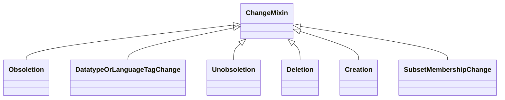

# Class: ChangeMixin
_root class for all change mixins_


* __NOTE__: this is a mixin class intended to be used in combination with other classes, and not used directly


URI: [kgcl_schema:ChangeMixin](https://w3id.org/kgcl-schema/ChangeMixin)





## Inheritance
* **ChangeMixin**
    * [Obsoletion](Obsoletion.md)
    * [DatatypeOrLanguageTagChange](DatatypeOrLanguageTagChange.md)
    * [Unobsoletion](Unobsoletion.md)
    * [Deletion](Deletion.md)
    * [Creation](Creation.md)
    * [SubsetMembershipChange](SubsetMembershipChange.md)


## Slots

| Name | Cardinality and Range  | Description  |
| ---  | ---  | --- |


## Usages


## Identifier and Mapping Information


### Schema Source


* from schema: https://w3id.org/hrshdhgd/kgcl-schema


## Mappings

| Mapping Type | Mapped Value |
| ---  | ---  |
| self | ['kgcl_schema:ChangeMixin'] |
| native | ['kgcl_schema:ChangeMixin'] |


## LinkML Specification

<!-- TODO: investigate https://stackoverflow.com/questions/37606292/how-to-create-tabbed-code-blocks-in-mkdocs-or-sphinx -->

### Direct

<details>
```yaml
name: change mixin
description: root class for all change mixins
from_schema: https://w3id.org/hrshdhgd/kgcl-schema
rank: 1000
mixin: true

```
</details>

### Induced

<details>
```yaml
name: change mixin
description: root class for all change mixins
from_schema: https://w3id.org/hrshdhgd/kgcl-schema
rank: 1000
mixin: true

```
</details>