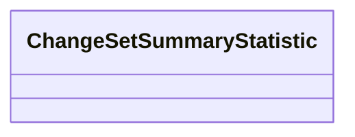

# Class: ChangeSetSummaryStatistic
_A summary statistic for a set of changes of the same type, grouped by zero or more node properties_


URI: [kgcl_schema:ChangeSetSummaryStatistic](https://w3id.org/kgcl-schema/ChangeSetSummaryStatistic)





<!-- no inheritance hierarchy -->


## Slots

| Name | Cardinality and Range  | Description  |
| ---  | ---  | --- |


## Usages


## Identifier and Mapping Information


### Schema Source


* from schema: https://w3id.org/hrshdhgd/kgcl-schema


## Mappings

| Mapping Type | Mapped Value |
| ---  | ---  |
| self | ['kgcl_schema:ChangeSetSummaryStatistic'] |
| native | ['kgcl_schema:ChangeSetSummaryStatistic'] |


## LinkML Specification

<!-- TODO: investigate https://stackoverflow.com/questions/37606292/how-to-create-tabbed-code-blocks-in-mkdocs-or-sphinx -->

### Direct

<details>
```yaml
name: change set summary statistic
description: A summary statistic for a set of changes of the same type, grouped by
  zero or more node properties
from_schema: https://w3id.org/hrshdhgd/kgcl-schema
rank: 1000
slot_usage:
  change type:
    name: change type
    range: change class type
  count:
    name: count
    range: integer
  property value set:
    name: property value set
    description: Summary statistic is grouped by these constraints

```
</details>

### Induced

<details>
```yaml
name: change set summary statistic
description: A summary statistic for a set of changes of the same type, grouped by
  zero or more node properties
from_schema: https://w3id.org/hrshdhgd/kgcl-schema
rank: 1000
slot_usage:
  change type:
    name: change type
    range: change class type
  count:
    name: count
    range: integer
  property value set:
    name: property value set
    description: Summary statistic is grouped by these constraints

```
</details>