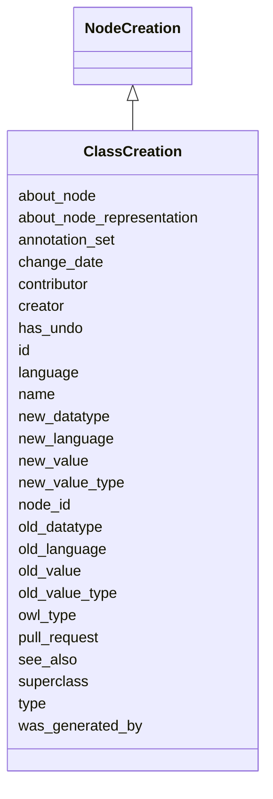

# Class: ClassCreation
_A node creation where the owl type is 'class'_


URI: [kgcl_schema:ClassCreation](https://w3id.org/kgcl-schema/ClassCreation)





## Inheritance
* [Change](Change.md)
    * [SimpleChange](SimpleChange.md)
        * [NodeChange](NodeChange.md)
            * [NodeCreation](NodeCreation.md) [ creation]
                * **ClassCreation**


## Slots

| Name | Cardinality and Range  | Description  |
| ---  | ---  | --- |
| [superclass](superclass.md) | 0..1 <br/> [Node](Node.md)  |   |
| [node_id](node_id.md) | 0..1 <br/> [Node](Node.md)  | id of a node to be created  |
| [name](name.md) | 0..1 <br/> [xsd:string](xsd:string)  |   |
| [owl_type](owl_type.md) | 0..1 <br/> [OwlTypeEnum](OwlTypeEnum.md)  |   |
| [annotation_set](annotation_set.md) | 0..1 <br/> [Annotation](Annotation.md)  |   |
| [language](language.md) | 0..1 <br/> [LanguageTag](LanguageTag.md)  | The language tag of a literal  |
| [about_node](about_node.md) | 0..1 <br/> [Node](Node.md)  |   |
| [about_node_representation](about_node_representation.md) | 0..1 <br/> [xsd:string](xsd:string)  | The representation of a node (URI, CURIE, label)   |
| [old_value](old_value.md) | 0..1 <br/> [xsd:string](xsd:string)  | The value of a property held in the old instance of the ontology  |
| [new_value](new_value.md) | 0..1 <br/> [xsd:string](xsd:string)  | The value of a property held in the new instance of the ontology  |
| [old_value_type](old_value_type.md) | 0..1 <br/> [xsd:string](xsd:string)  | The type (IRI or Literal) of an old value  |
| [new_value_type](new_value_type.md) | 0..1 <br/> [xsd:string](xsd:string)  | The type (IRI or Literal) of a new value  |
| [new_language](new_language.md) | 0..1 <br/> [xsd:string](xsd:string)  | The new language tag of a literal  |
| [old_language](old_language.md) | 0..1 <br/> [xsd:string](xsd:string)  | The old language tag of a literal  |
| [new_datatype](new_datatype.md) | 0..1 <br/> [xsd:string](xsd:string)  | The new datatype of a literal  |
| [old_datatype](old_datatype.md) | 0..1 <br/> [xsd:string](xsd:string)  | The old datatype of a literal  |
| [id](id.md) | 1..1 <br/> [xsd:string](xsd:string)  |   |
| [type](type.md) | 0..1 <br/> [xsd:string](xsd:string)  |   |
| [was_generated_by](was_generated_by.md) | 0..1 <br/> [Activity](Activity.md)  |   |
| [see_also](see_also.md) | 0..1 <br/> [xsd:string](xsd:string)  |   |
| [pull_request](pull_request.md) | 0..1 <br/> [xsd:string](xsd:string)  |   |
| [creator](creator.md) | 0..1 <br/> [xsd:string](xsd:string)  |   |
| [change_date](change_date.md) | 0..1 <br/> [xsd:string](xsd:string)  |   |
| [contributor](contributor.md) | 0..1 <br/> [xsd:string](xsd:string)  |   |
| [has_undo](has_undo.md) | 0..1 <br/> [Deletion](Deletion.md)  | A change that reverses this change  |


## Usages


## TODOs

* restrict owltype value

## Identifier and Mapping Information


### Schema Source


* from schema: https://w3id.org/hrshdhgd/kgcl-schema


## Mappings

| Mapping Type | Mapped Value |
| ---  | ---  |
| self | ['kgcl_schema:ClassCreation'] |
| native | ['kgcl_schema:ClassCreation'] |


## LinkML Specification

<!-- TODO: investigate https://stackoverflow.com/questions/37606292/how-to-create-tabbed-code-blocks-in-mkdocs-or-sphinx -->

### Direct

<details>
```yaml
name: class creation
description: A node creation where the owl type is 'class'
todos:
- restrict owltype value
from_schema: https://w3id.org/hrshdhgd/kgcl-schema
rank: 1000
is_a: node creation
slots:
- superclass
slot_usage:
  change description:
    name: change description
    string_serialization: creating {about node}

```
</details>

### Induced

<details>
```yaml
name: class creation
description: A node creation where the owl type is 'class'
todos:
- restrict owltype value
from_schema: https://w3id.org/hrshdhgd/kgcl-schema
rank: 1000
is_a: node creation
slot_usage:
  change description:
    name: change description
    string_serialization: creating {about node}
attributes:
  superclass:
    name: superclass
    from_schema: https://w3id.org/hrshdhgd/kgcl-schema
    rank: 1000
    alias: superclass
    owner: class creation
    domain_of:
    - class creation
    range: node
  node id:
    name: node id
    description: id of a node to be created
    todos:
    - consider using 'about' instead
    from_schema: https://w3id.org/hrshdhgd/kgcl-schema
    rank: 1000
    alias: node_id
    owner: class creation
    domain_of:
    - node creation
    range: node
  name:
    name: name
    from_schema: https://w3id.org/kgcl_schema/ontology
    rank: 1000
    alias: name
    owner: class creation
    domain_of:
    - node creation
    - node
    range: string
  owl type:
    name: owl type
    from_schema: https://w3id.org/kgcl_schema/ontology
    rank: 1000
    alias: owl_type
    owner: class creation
    domain_of:
    - node creation
    - node
    range: owl_type_enum
  annotation set:
    name: annotation set
    from_schema: https://w3id.org/kgcl_schema/ontology
    rank: 1000
    alias: annotation_set
    owner: class creation
    domain_of:
    - edge creation
    - edge deletion
    - edge obsoletion
    - mapping creation
    - node creation
    - annotation
    - node
    - edge
    range: annotation
  language:
    name: language
    description: The language tag of a literal
    from_schema: https://w3id.org/hrshdhgd/kgcl-schema
    rank: 1000
    alias: language
    owner: class creation
    domain_of:
    - edge change
    - node change
    - new synonym
    - node creation
    range: language tag
  about node:
    name: about node
    from_schema: https://w3id.org/hrshdhgd/kgcl-schema
    rank: 1000
    is_a: about
    multivalued: false
    alias: about_node
    owner: class creation
    domain_of:
    - node change
    range: node
  about node representation:
    name: about node representation
    description: 'The representation of a node (URI, CURIE, label) '
    deprecated: no longer required
    from_schema: https://w3id.org/hrshdhgd/kgcl-schema
    rank: 1000
    alias: about_node_representation
    owner: class creation
    domain_of:
    - node change
    range: string
  old value:
    name: old value
    description: The value of a property held in the old instance of the ontology
    from_schema: https://w3id.org/hrshdhgd/kgcl-schema
    rank: 1000
    alias: old_value
    owner: class creation
    domain_of:
    - simple change
    - node rename
    - set language for name
    - remove synonym
    - synonym replacement
    - synonym predicate change
    - remove text definition
    - text definition replacement
    range: string
  new value:
    name: new value
    description: The value of a property held in the new instance of the ontology
    from_schema: https://w3id.org/hrshdhgd/kgcl-schema
    rank: 1000
    alias: new_value
    owner: class creation
    domain_of:
    - simple change
    - node rename
    - set language for name
    - new synonym
    - synonym replacement
    - synonym predicate change
    - new text definition
    - text definition replacement
    range: string
  old value type:
    name: old value type
    description: The type (IRI or Literal) of an old value
    deprecated: no longer required
    from_schema: https://w3id.org/hrshdhgd/kgcl-schema
    rank: 1000
    alias: old_value_type
    owner: class creation
    domain_of:
    - simple change
    range: string
  new value type:
    name: new value type
    description: The type (IRI or Literal) of a new value
    deprecated: no longer required
    from_schema: https://w3id.org/hrshdhgd/kgcl-schema
    rank: 1000
    alias: new_value_type
    owner: class creation
    domain_of:
    - simple change
    range: string
  new language:
    name: new language
    description: The new language tag of a literal
    from_schema: https://w3id.org/hrshdhgd/kgcl-schema
    rank: 1000
    alias: new_language
    owner: class creation
    domain_of:
    - simple change
    - node rename
    range: string
  old language:
    name: old language
    description: The old language tag of a literal
    from_schema: https://w3id.org/hrshdhgd/kgcl-schema
    rank: 1000
    alias: old_language
    owner: class creation
    domain_of:
    - simple change
    - node rename
    range: string
  new datatype:
    name: new datatype
    description: The new datatype of a literal
    from_schema: https://w3id.org/hrshdhgd/kgcl-schema
    rank: 1000
    alias: new_datatype
    owner: class creation
    domain_of:
    - simple change
    range: string
  old datatype:
    name: old datatype
    description: The old datatype of a literal
    from_schema: https://w3id.org/hrshdhgd/kgcl-schema
    rank: 1000
    alias: old_datatype
    owner: class creation
    domain_of:
    - simple change
    range: string
  id:
    name: id
    from_schema: https://w3id.org/kgcl_schema/basics
    rank: 1000
    identifier: true
    alias: id
    owner: class creation
    domain_of:
    - change
    - activity
    - agent
    - node
    range: string
  type:
    name: type
    from_schema: https://w3id.org/hrshdhgd/kgcl-schema
    rank: 1000
    slot_uri: rdf:type
    designates_type: true
    alias: type
    owner: class creation
    domain_of:
    - change
    range: string
  was generated by:
    name: was generated by
    from_schema: https://w3id.org/kgcl_schema/prov
    rank: 1000
    slot_uri: prov:wasGeneratedBy
    alias: was_generated_by
    owner: class creation
    domain_of:
    - change
    range: activity
  see also:
    name: see also
    from_schema: https://w3id.org/hrshdhgd/kgcl-schema
    rank: 1000
    slot_uri: rdfs:seeAlso
    alias: see_also
    owner: class creation
    domain_of:
    - change
    range: string
  pull request:
    name: pull request
    from_schema: https://w3id.org/hrshdhgd/kgcl-schema
    rank: 1000
    alias: pull_request
    owner: class creation
    domain_of:
    - change
    range: string
  creator:
    name: creator
    from_schema: https://w3id.org/hrshdhgd/kgcl-schema
    rank: 1000
    slot_uri: dcterms:creator
    alias: creator
    owner: class creation
    domain_of:
    - change
    range: string
  change date:
    name: change date
    from_schema: https://w3id.org/hrshdhgd/kgcl-schema
    rank: 1000
    slot_uri: dcterms:date
    alias: change_date
    owner: class creation
    domain_of:
    - change
    range: string
  contributor:
    name: contributor
    from_schema: https://w3id.org/hrshdhgd/kgcl-schema
    rank: 1000
    slot_uri: dcterms:creator
    alias: contributor
    owner: class creation
    domain_of:
    - change
    range: string
  has undo:
    name: has undo
    description: A change that reverses this change
    from_schema: https://w3id.org/hrshdhgd/kgcl-schema
    rank: 1000
    domain: change
    multivalued: false
    alias: has_undo
    owner: class creation
    domain_of:
    - change
    range: deletion

```
</details>