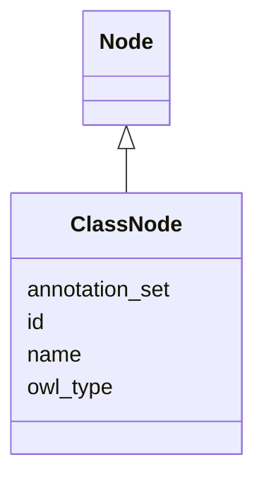

# Class: ClassNode
_A node that is a class_


URI: [owl:Class](owl:Class)





## Inheritance
* [OntologyElement](OntologyElement.md)
    * [Node](Node.md)
        * **ClassNode**


## Slots

| Name | Cardinality and Range  | Description  |
| ---  | ---  | --- |
| [id](id.md) | 1..1 <br/> [xsd:string](xsd:string)  |   |
| [name](name.md) | 0..1 <br/> [xsd:string](xsd:string)  |   |
| [annotation_set](annotation_set.md) | 0..1 <br/> [Annotation](Annotation.md)  |   |
| [owl_type](owl_type.md) | 0..1 <br/> [OwlTypeEnum](OwlTypeEnum.md)  |   |


## Usages


## Identifier and Mapping Information


### Schema Source


* from schema: https://w3id.org/kgcl_schema/ontology


## Mappings

| Mapping Type | Mapped Value |
| ---  | ---  |
| self | ['owl:Class'] |
| native | ['om:ClassNode'] |


## LinkML Specification

<!-- TODO: investigate https://stackoverflow.com/questions/37606292/how-to-create-tabbed-code-blocks-in-mkdocs-or-sphinx -->

### Direct

<details>
```yaml
name: class node
description: A node that is a class
from_schema: https://w3id.org/kgcl_schema/ontology
aliases:
- concept
rank: 1000
is_a: node
class_uri: owl:Class

```
</details>

### Induced

<details>
```yaml
name: class node
description: A node that is a class
from_schema: https://w3id.org/kgcl_schema/ontology
aliases:
- concept
rank: 1000
is_a: node
attributes:
  id:
    name: id
    from_schema: https://w3id.org/kgcl_schema/basics
    rank: 1000
    identifier: true
    alias: id
    owner: class node
    domain_of:
    - change
    - activity
    - agent
    - node
    range: string
  name:
    name: name
    from_schema: https://w3id.org/kgcl_schema/ontology
    rank: 1000
    alias: name
    owner: class node
    domain_of:
    - node creation
    - node
    range: string
  annotation set:
    name: annotation set
    from_schema: https://w3id.org/kgcl_schema/ontology
    rank: 1000
    alias: annotation_set
    owner: class node
    domain_of:
    - edge creation
    - edge deletion
    - edge obsoletion
    - mapping creation
    - node creation
    - annotation
    - node
    - edge
    range: annotation
  owl type:
    name: owl type
    from_schema: https://w3id.org/kgcl_schema/ontology
    rank: 1000
    alias: owl_type
    owner: class node
    domain_of:
    - node creation
    - node
    range: owl_type_enum
class_uri: owl:Class

```
</details>