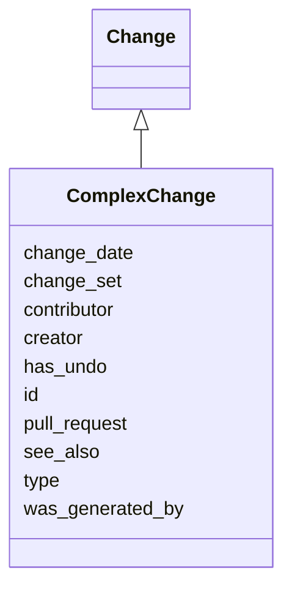

# Class: ComplexChange
_A change that is is a composition of other changes_


* __NOTE__: this is an abstract class and should not be instantiated directly


URI: [kgcl_schema:ComplexChange](https://w3id.org/kgcl-schema/ComplexChange)





## Inheritance
* [Change](Change.md)
    * **ComplexChange**
        * [MultiNodeObsoletion](MultiNodeObsoletion.md)


## Slots

| Name | Cardinality and Range  | Description  |
| ---  | ---  | --- |
| [change_set](change_set.md) | 0..* <br/> [Change](Change.md)  | A collection of changes  |
| [id](id.md) | 1..1 <br/> [xsd:string](xsd:string)  |   |
| [type](type.md) | 0..1 <br/> [xsd:string](xsd:string)  |   |
| [was_generated_by](was_generated_by.md) | 0..1 <br/> [Activity](Activity.md)  |   |
| [see_also](see_also.md) | 0..1 <br/> [xsd:string](xsd:string)  |   |
| [pull_request](pull_request.md) | 0..1 <br/> [xsd:string](xsd:string)  |   |
| [creator](creator.md) | 0..1 <br/> [xsd:string](xsd:string)  |   |
| [change_date](change_date.md) | 0..1 <br/> [xsd:string](xsd:string)  |   |
| [contributor](contributor.md) | 0..1 <br/> [xsd:string](xsd:string)  |   |
| [has_undo](has_undo.md) | 0..1 <br/> [Change](Change.md)  | A change that reverses this change  |


## Usages


## Identifier and Mapping Information


### Schema Source


* from schema: https://w3id.org/hrshdhgd/kgcl-schema


## Mappings

| Mapping Type | Mapped Value |
| ---  | ---  |
| self | ['kgcl_schema:ComplexChange'] |
| native | ['kgcl_schema:ComplexChange'] |


## LinkML Specification

<!-- TODO: investigate https://stackoverflow.com/questions/37606292/how-to-create-tabbed-code-blocks-in-mkdocs-or-sphinx -->

### Direct

<details>
```yaml
name: complex change
description: A change that is is a composition of other changes
from_schema: https://w3id.org/hrshdhgd/kgcl-schema
rank: 1000
is_a: change
abstract: true
slots:
- change set

```
</details>

### Induced

<details>
```yaml
name: complex change
description: A change that is is a composition of other changes
from_schema: https://w3id.org/hrshdhgd/kgcl-schema
rank: 1000
is_a: change
abstract: true
attributes:
  change set:
    name: change set
    description: A collection of changes
    from_schema: https://w3id.org/hrshdhgd/kgcl-schema
    rank: 1000
    multivalued: true
    alias: change_set
    owner: complex change
    domain_of:
    - complex change
    - transaction
    - session
    range: change
    inlined: true
    inlined_as_list: true
  id:
    name: id
    from_schema: https://w3id.org/kgcl_schema/basics
    rank: 1000
    identifier: true
    alias: id
    owner: complex change
    domain_of:
    - change
    - activity
    - agent
    - node
    range: string
  type:
    name: type
    from_schema: https://w3id.org/hrshdhgd/kgcl-schema
    rank: 1000
    slot_uri: rdf:type
    designates_type: true
    alias: type
    owner: complex change
    domain_of:
    - change
    range: string
  was generated by:
    name: was generated by
    from_schema: https://w3id.org/kgcl_schema/prov
    rank: 1000
    slot_uri: prov:wasGeneratedBy
    alias: was_generated_by
    owner: complex change
    domain_of:
    - change
    range: activity
  see also:
    name: see also
    from_schema: https://w3id.org/hrshdhgd/kgcl-schema
    rank: 1000
    slot_uri: rdfs:seeAlso
    alias: see_also
    owner: complex change
    domain_of:
    - change
    range: string
  pull request:
    name: pull request
    from_schema: https://w3id.org/hrshdhgd/kgcl-schema
    rank: 1000
    alias: pull_request
    owner: complex change
    domain_of:
    - change
    range: string
  creator:
    name: creator
    from_schema: https://w3id.org/hrshdhgd/kgcl-schema
    rank: 1000
    slot_uri: dcterms:creator
    alias: creator
    owner: complex change
    domain_of:
    - change
    range: string
  change date:
    name: change date
    from_schema: https://w3id.org/hrshdhgd/kgcl-schema
    rank: 1000
    slot_uri: dcterms:date
    alias: change_date
    owner: complex change
    domain_of:
    - change
    range: string
  contributor:
    name: contributor
    from_schema: https://w3id.org/hrshdhgd/kgcl-schema
    rank: 1000
    slot_uri: dcterms:creator
    alias: contributor
    owner: complex change
    domain_of:
    - change
    range: string
  has undo:
    name: has undo
    description: A change that reverses this change
    from_schema: https://w3id.org/hrshdhgd/kgcl-schema
    rank: 1000
    domain: change
    multivalued: false
    alias: has_undo
    owner: complex change
    domain_of:
    - change
    range: change

```
</details>