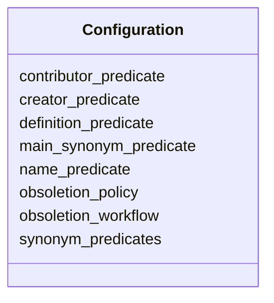

# Class: Configuration
_The meaning of operations can be configured_


URI: [kgcl_schema:Configuration](https://w3id.org/kgcl-schema/Configuration)





<!-- no inheritance hierarchy -->


## Slots

| Name | Cardinality and Range  | Description  |
| ---  | ---  | --- |
| [name_predicate](name_predicate.md) | 0..1 <br/> [xsd:string](xsd:string)  |   |
| [definition_predicate](definition_predicate.md) | 0..1 <br/> [xsd:string](xsd:string)  |   |
| [main_synonym_predicate](main_synonym_predicate.md) | 0..1 <br/> [xsd:string](xsd:string)  |   |
| [synonym_predicates](synonym_predicates.md) | 0..1 <br/> [xsd:string](xsd:string)  |   |
| [creator_predicate](creator_predicate.md) | 0..1 <br/> [xsd:string](xsd:string)  |   |
| [contributor_predicate](contributor_predicate.md) | 0..1 <br/> [xsd:string](xsd:string)  |   |
| [obsoletion_workflow](obsoletion_workflow.md) | 0..1 <br/> [xsd:string](xsd:string)  |   |
| [obsoletion_policy](obsoletion_policy.md) | 0..1 <br/> [xsd:string](xsd:string)  |   |


## Usages


## Identifier and Mapping Information


### Schema Source


* from schema: https://w3id.org/hrshdhgd/kgcl-schema


## Mappings

| Mapping Type | Mapped Value |
| ---  | ---  |
| self | ['kgcl_schema:Configuration'] |
| native | ['kgcl_schema:Configuration'] |


## LinkML Specification

<!-- TODO: investigate https://stackoverflow.com/questions/37606292/how-to-create-tabbed-code-blocks-in-mkdocs-or-sphinx -->

### Direct

<details>
```yaml
name: configuration
description: The meaning of operations can be configured
from_schema: https://w3id.org/hrshdhgd/kgcl-schema
rank: 1000
attributes:
  name predicate:
    name: name predicate
    from_schema: https://w3id.org/hrshdhgd/kgcl-schema
    rank: 1000
  definition predicate:
    name: definition predicate
    from_schema: https://w3id.org/hrshdhgd/kgcl-schema
    rank: 1000
  main synonym predicate:
    name: main synonym predicate
    from_schema: https://w3id.org/hrshdhgd/kgcl-schema
    rank: 1000
  synonym predicates:
    name: synonym predicates
    from_schema: https://w3id.org/hrshdhgd/kgcl-schema
    rank: 1000
  creator predicate:
    name: creator predicate
    from_schema: https://w3id.org/hrshdhgd/kgcl-schema
    rank: 1000
  contributor predicate:
    name: contributor predicate
    from_schema: https://w3id.org/hrshdhgd/kgcl-schema
    rank: 1000
  obsoletion workflow:
    name: obsoletion workflow
    from_schema: https://w3id.org/hrshdhgd/kgcl-schema
    rank: 1000
  obsoletion policy:
    name: obsoletion policy
    from_schema: https://w3id.org/hrshdhgd/kgcl-schema
    rank: 1000

```
</details>

### Induced

<details>
```yaml
name: configuration
description: The meaning of operations can be configured
from_schema: https://w3id.org/hrshdhgd/kgcl-schema
rank: 1000
attributes:
  name predicate:
    name: name predicate
    from_schema: https://w3id.org/hrshdhgd/kgcl-schema
    rank: 1000
    alias: name_predicate
    owner: configuration
    domain_of:
    - configuration
    range: string
  definition predicate:
    name: definition predicate
    from_schema: https://w3id.org/hrshdhgd/kgcl-schema
    rank: 1000
    alias: definition_predicate
    owner: configuration
    domain_of:
    - configuration
    range: string
  main synonym predicate:
    name: main synonym predicate
    from_schema: https://w3id.org/hrshdhgd/kgcl-schema
    rank: 1000
    alias: main_synonym_predicate
    owner: configuration
    domain_of:
    - configuration
    range: string
  synonym predicates:
    name: synonym predicates
    from_schema: https://w3id.org/hrshdhgd/kgcl-schema
    rank: 1000
    alias: synonym_predicates
    owner: configuration
    domain_of:
    - configuration
    range: string
  creator predicate:
    name: creator predicate
    from_schema: https://w3id.org/hrshdhgd/kgcl-schema
    rank: 1000
    alias: creator_predicate
    owner: configuration
    domain_of:
    - configuration
    range: string
  contributor predicate:
    name: contributor predicate
    from_schema: https://w3id.org/hrshdhgd/kgcl-schema
    rank: 1000
    alias: contributor_predicate
    owner: configuration
    domain_of:
    - configuration
    range: string
  obsoletion workflow:
    name: obsoletion workflow
    from_schema: https://w3id.org/hrshdhgd/kgcl-schema
    rank: 1000
    alias: obsoletion_workflow
    owner: configuration
    domain_of:
    - configuration
    range: string
  obsoletion policy:
    name: obsoletion policy
    from_schema: https://w3id.org/hrshdhgd/kgcl-schema
    rank: 1000
    alias: obsoletion_policy
    owner: configuration
    domain_of:
    - configuration
    range: string

```
</details>