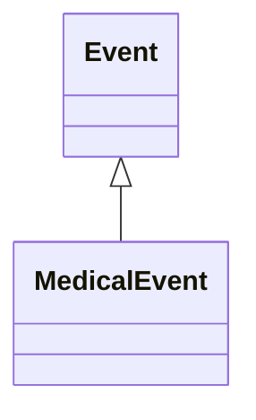

# Class: Event
_grouping class for events_


URI: [TEMP:Event](https://example.org/TEMP/Event)





## Inheritance
* **Event**
    * [MedicalEvent](MedicalEvent.md)


## Slots

| Name | Cardinality and Range  | Description  |
| ---  | ---  | --- |


## Usages


## Identifier and Mapping Information


### Schema Source


* from schema: TEMP


## Mappings

| Mapping Type | Mapped Value |
| ---  | ---  |
| self | ['TEMP:Event'] |
| native | ['TEMP:Event'] |
| exact | ['wikidata:Q1656682', 'wikidata:Q1656682'] |


## LinkML Specification

<!-- TODO: investigate https://stackoverflow.com/questions/37606292/how-to-create-tabbed-code-blocks-in-mkdocs-or-sphinx -->

### Direct

<details>
```yaml
name: Event
description: grouping class for events
in_subset:
- a
- a
from_schema: TEMP
exact_mappings:
- wikidata:Q1656682
- wikidata:Q1656682
rank: 1000
status: release

```
</details>

### Induced

<details>
```yaml
name: Event
description: grouping class for events
in_subset:
- a
- a
from_schema: TEMP
exact_mappings:
- wikidata:Q1656682
- wikidata:Q1656682
rank: 1000
status: release

```
</details>