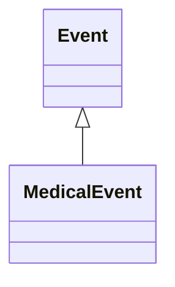

# Class: MedicalEvent
_a medical encounter_


URI: [TEMP:MedicalEvent](https://example.org/TEMP/MedicalEvent)





## Inheritance
* [Event](Event.md)
    * **MedicalEvent**


## Slots

| Name | Cardinality and Range  | Description  |
| ---  | ---  | --- |


## Usages


| used by | used in | type | used |
| ---  | --- | --- | --- |
| [Person](Person.md) | [has_medical_history](has_medical_history.md) | range | MedicalEvent |


## Identifier and Mapping Information


### Schema Source


* from schema: TEMP


## Mappings

| Mapping Type | Mapped Value |
| ---  | ---  |
| self | ['TEMP:MedicalEvent'] |
| native | ['TEMP:MedicalEvent'] |


## LinkML Specification

<!-- TODO: investigate https://stackoverflow.com/questions/37606292/how-to-create-tabbed-code-blocks-in-mkdocs-or-sphinx -->

### Direct

<details>
```yaml
name: MedicalEvent
description: a medical encounter
in_subset:
- b
- b
from_schema: TEMP
rank: 1000
is_a: Event
status: testing

```
</details>

### Induced

<details>
```yaml
name: MedicalEvent
description: a medical encounter
in_subset:
- b
- b
from_schema: TEMP
rank: 1000
is_a: Event
status: testing

```
</details>