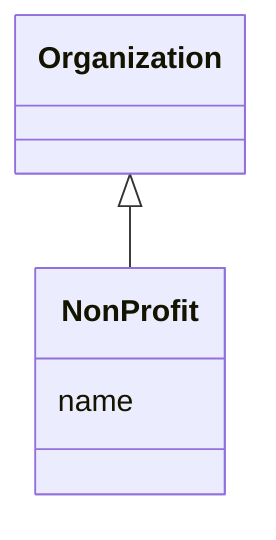

# Class: NonProfit


URI: [TEMP:NonProfit](https://example.org/TEMP/NonProfit)





## Inheritance
* [Organization](Organization.md)
    * **NonProfit**


## Slots

| Name | Cardinality and Range  | Description  |
| ---  | ---  | --- |
| [name](name.md) | 1..1 <br/> [xsd:string](xsd:string)  |   |


## Usages


## Identifier and Mapping Information


### Schema Source


* from schema: TEMP


## Mappings

| Mapping Type | Mapped Value |
| ---  | ---  |
| self | ['TEMP:NonProfit'] |
| native | ['TEMP:NonProfit'] |
| exact | ['wikidata:Q163740', 'wikidata:Q163740'] |


## LinkML Specification

<!-- TODO: investigate https://stackoverflow.com/questions/37606292/how-to-create-tabbed-code-blocks-in-mkdocs-or-sphinx -->

### Direct

<details>
```yaml
name: NonProfit
from_schema: TEMP
exact_mappings:
- wikidata:Q163740
- wikidata:Q163740
rank: 1000
is_a: Organization

```
</details>

### Induced

<details>
```yaml
name: NonProfit
from_schema: TEMP
exact_mappings:
- wikidata:Q163740
- wikidata:Q163740
rank: 1000
is_a: Organization
attributes:
  name:
    name: name
    from_schema: TEMP
    rank: 1000
    multivalued: false
    alias: name
    owner: NonProfit
    domain_of:
    - Person
    - Organization
    range: string
    required: true

```
</details>