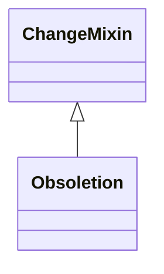

# Class: Obsoletion
_Obsoletion of an element deprecates usage of that element, but does not delete that element._


* __NOTE__: this is a mixin class intended to be used in combination with other classes, and not used directly


URI: [kgcl_schema:Obsoletion](https://w3id.org/kgcl-schema/Obsoletion)





## Inheritance
* [ChangeMixin](ChangeMixin.md)
    * **Obsoletion**
        * [AllowsAutomaticReplacementOfEdges](AllowsAutomaticReplacementOfEdges.md)


## Slots

| Name | Cardinality and Range  | Description  |
| ---  | ---  | --- |


## Usages


| used by | used in | type | used |
| ---  | --- | --- | --- |
| [EdgeObsoletion](EdgeObsoletion.md) | [has_undo](has_undo.md) | range | obsoletion |
| [NodeObsoletion](NodeObsoletion.md) | [has_undo](has_undo.md) | range | obsoletion |
| [NodeUnobsoletion](NodeUnobsoletion.md) | [has_undo](has_undo.md) | range | obsoletion |
| [NodeDirectMerge](NodeDirectMerge.md) | [has_undo](has_undo.md) | range | obsoletion |
| [NodeObsoletionWithDirectReplacement](NodeObsoletionWithDirectReplacement.md) | [has_undo](has_undo.md) | range | obsoletion |
| [NodeObsoletionWithNoDirectReplacement](NodeObsoletionWithNoDirectReplacement.md) | [has_undo](has_undo.md) | range | obsoletion |


## Comments

* In OWL, deprecation is handled by the deprecation axiom. In OBO, we use this, but place additional requirements and expectations on obsolete elements

## Identifier and Mapping Information


### Schema Source


* from schema: https://w3id.org/hrshdhgd/kgcl-schema


## Mappings

| Mapping Type | Mapped Value |
| ---  | ---  |
| self | ['kgcl_schema:Obsoletion'] |
| native | ['kgcl_schema:Obsoletion'] |


## LinkML Specification

<!-- TODO: investigate https://stackoverflow.com/questions/37606292/how-to-create-tabbed-code-blocks-in-mkdocs-or-sphinx -->

### Direct

<details>
```yaml
name: obsoletion
description: Obsoletion of an element deprecates usage of that element, but does not
  delete that element.
comments:
- In OWL, deprecation is handled by the deprecation axiom. In OBO, we use this, but
  place additional requirements and expectations on obsolete elements
from_schema: https://w3id.org/hrshdhgd/kgcl-schema
see_also:
- http://wiki.geneontology.org/index.php/Obsoleting_an_Existing_Ontology_Term
- https://mondo.readthedocs.io/en/latest/editors-guide/merging-and-obsoleting/
aliases:
- deprecation
- retiring
rank: 1000
is_a: change mixin
mixin: true
slot_usage:
  about:
    name: about
    description: The element that is obsoleted by this change.
  has undo:
    name: has undo
    range: obsoletion

```
</details>

### Induced

<details>
```yaml
name: obsoletion
description: Obsoletion of an element deprecates usage of that element, but does not
  delete that element.
comments:
- In OWL, deprecation is handled by the deprecation axiom. In OBO, we use this, but
  place additional requirements and expectations on obsolete elements
from_schema: https://w3id.org/hrshdhgd/kgcl-schema
see_also:
- http://wiki.geneontology.org/index.php/Obsoleting_an_Existing_Ontology_Term
- https://mondo.readthedocs.io/en/latest/editors-guide/merging-and-obsoleting/
aliases:
- deprecation
- retiring
rank: 1000
is_a: change mixin
mixin: true
slot_usage:
  about:
    name: about
    description: The element that is obsoleted by this change.
  has undo:
    name: has undo
    range: obsoletion

```
</details>