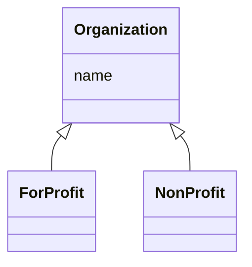

# Class: Organization


URI: [TEMP:Organization](https://example.org/TEMP/Organization)





## Inheritance
* **Organization**
    * [ForProfit](ForProfit.md)
    * [NonProfit](NonProfit.md)


## Slots

| Name | Cardinality and Range  | Description  |
| ---  | ---  | --- |
| [name](name.md) | 1..1 <br/> [xsd:string](xsd:string)  | full name  |


## Usages


## Identifier and Mapping Information


### Schema Source


* from schema: TEMP


## Mappings

| Mapping Type | Mapped Value |
| ---  | ---  |
| self | ['TEMP:Organization'] |
| native | ['TEMP:Organization'] |


## LinkML Specification

<!-- TODO: investigate https://stackoverflow.com/questions/37606292/how-to-create-tabbed-code-blocks-in-mkdocs-or-sphinx -->

### Direct

<details>
```yaml
name: Organization
from_schema: TEMP
rank: 1000
slots:
- name
slot_usage:
  name:
    name: name
    annotations:
      special:
        tag: special
        value: my_val
    description: full name
    exact_mappings:
    - sdo:name
    multivalued: false
    domain_of:
    - Person
    - Organization
    - Person
    - Organization
    range: string
    required: true

```
</details>

### Induced

<details>
```yaml
name: Organization
from_schema: TEMP
rank: 1000
slot_usage:
  name:
    name: name
    annotations:
      special:
        tag: special
        value: my_val
    description: full name
    exact_mappings:
    - sdo:name
    multivalued: false
    domain_of:
    - Person
    - Organization
    - Person
    - Organization
    range: string
    required: true
attributes:
  name:
    name: name
    annotations:
      special:
        tag: special
        value: my_val
    description: full name
    from_schema: TEMP
    exact_mappings:
    - sdo:name
    rank: 1000
    multivalued: false
    alias: name
    owner: Organization
    domain_of:
    - Person
    - Organization
    - Person
    - Organization
    range: string
    required: true

```
</details>