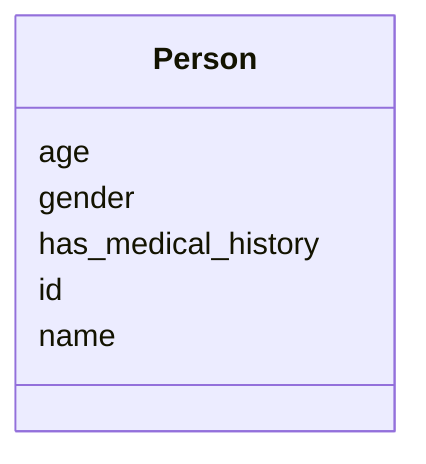

# Class: Person
_a person,living or dead_


URI: [TEMP:Person](https://example.org/TEMP/Person)





<!-- no inheritance hierarchy -->


## Slots

| Name | Cardinality and Range  | Description  |
| ---  | ---  | --- |
| [id](id.md) | 1..1 <br/> [xsd:string](xsd:string)  | identifier for a person  |
| [name](name.md) | 1..1 <br/> [xsd:string](xsd:string)  | full name  |
| [age](age.md) | 0..1 <br/> [xsd:decimal](xsd:decimal)  | age in years  |
| [gender](gender.md) | 0..1 <br/> [xsd:decimal](xsd:decimal)  | age in years  |
| [has_medical_history](has_medical_history.md) | 0..* <br/> [MedicalEvent](MedicalEvent.md)  | medical history  |


## Usages


## Identifier and Mapping Information


### Schema Source


* from schema: TEMP


## Mappings

| Mapping Type | Mapped Value |
| ---  | ---  |
| self | ['TEMP:Person'] |
| native | ['TEMP:Person'] |
| exact | ['sdo:Person', 'wikidata:Q215627', 'sdo:Person', 'wikidata:Q215627'] |


## LinkML Specification

<!-- TODO: investigate https://stackoverflow.com/questions/37606292/how-to-create-tabbed-code-blocks-in-mkdocs-or-sphinx -->

### Direct

<details>
```yaml
name: Person
description: a person,living or dead
from_schema: TEMP
exact_mappings:
- sdo:Person
- wikidata:Q215627
- sdo:Person
- wikidata:Q215627
rank: 1000
status: release
slots:
- id
- name
- age
- gender
- has medical history
slot_usage:
  id:
    name: id
    description: identifier for a person
    exact_mappings:
    - sdo:identifier
    multivalued: false
    identifier: true
    domain_of:
    - Person
    - Person
    range: string
    required: true
  name:
    name: name
    annotations:
      special:
        tag: special
        value: my_val
    description: full name
    exact_mappings:
    - sdo:name
    multivalued: false
    domain_of:
    - Person
    - Organization
    - Person
    - Organization
    range: string
    required: true
  age:
    name: age
    description: age in years
    multivalued: false
    domain_of:
    - Person
    - Person
    range: decimal
    required: false
  gender:
    name: gender
    description: age in years
    multivalued: false
    domain_of:
    - Person
    - Person
    range: decimal
    required: false
  has medical history:
    name: has medical history
    description: medical history
    status: testing
    multivalued: true
    domain_of:
    - Person
    - Person
    range: MedicalEvent
    required: false

```
</details>

### Induced

<details>
```yaml
name: Person
description: a person,living or dead
from_schema: TEMP
exact_mappings:
- sdo:Person
- wikidata:Q215627
- sdo:Person
- wikidata:Q215627
rank: 1000
status: release
slot_usage:
  id:
    name: id
    description: identifier for a person
    exact_mappings:
    - sdo:identifier
    multivalued: false
    identifier: true
    domain_of:
    - Person
    - Person
    range: string
    required: true
  name:
    name: name
    annotations:
      special:
        tag: special
        value: my_val
    description: full name
    exact_mappings:
    - sdo:name
    multivalued: false
    domain_of:
    - Person
    - Organization
    - Person
    - Organization
    range: string
    required: true
  age:
    name: age
    description: age in years
    multivalued: false
    domain_of:
    - Person
    - Person
    range: decimal
    required: false
  gender:
    name: gender
    description: age in years
    multivalued: false
    domain_of:
    - Person
    - Person
    range: decimal
    required: false
  has medical history:
    name: has medical history
    description: medical history
    status: testing
    multivalued: true
    domain_of:
    - Person
    - Person
    range: MedicalEvent
    required: false
attributes:
  id:
    name: id
    description: identifier for a person
    from_schema: TEMP
    exact_mappings:
    - sdo:identifier
    rank: 1000
    multivalued: false
    identifier: true
    alias: id
    owner: Person
    domain_of:
    - Person
    range: string
    required: true
  name:
    name: name
    annotations:
      special:
        tag: special
        value: my_val
    description: full name
    from_schema: TEMP
    exact_mappings:
    - sdo:name
    rank: 1000
    multivalued: false
    alias: name
    owner: Person
    domain_of:
    - Person
    - Organization
    range: string
    required: true
  age:
    name: age
    description: age in years
    from_schema: TEMP
    rank: 1000
    multivalued: false
    alias: age
    owner: Person
    domain_of:
    - Person
    range: decimal
    required: false
  gender:
    name: gender
    description: age in years
    from_schema: TEMP
    rank: 1000
    multivalued: false
    alias: gender
    owner: Person
    domain_of:
    - Person
    range: decimal
    required: false
  has medical history:
    name: has medical history
    description: medical history
    from_schema: TEMP
    rank: 1000
    status: testing
    multivalued: true
    alias: has_medical_history
    owner: Person
    domain_of:
    - Person
    range: MedicalEvent
    required: false

```
</details>