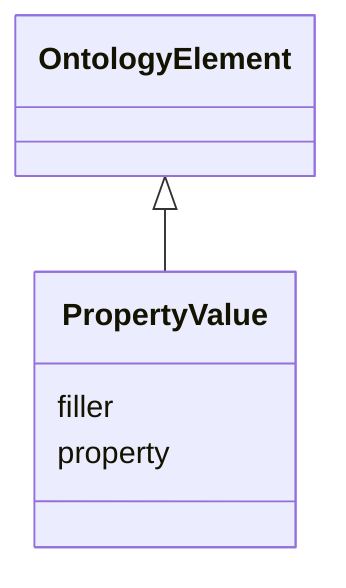

# Class: PropertyValue
_a property-value pair_


URI: [om:PropertyValue](om:PropertyValue)





## Inheritance
* [OntologyElement](OntologyElement.md)
    * **PropertyValue**
        * [Annotation](Annotation.md)


## Slots

| Name | Cardinality and Range  | Description  |
| ---  | ---  | --- |
| [property](property.md) | 0..1 <br/> [Node](Node.md)  |   |
| [filler](filler.md) | 0..1 <br/> [xsd:string](xsd:string)  |   |


## Usages


## Identifier and Mapping Information


### Schema Source


* from schema: https://w3id.org/kgcl_schema/ontology


## Mappings

| Mapping Type | Mapped Value |
| ---  | ---  |
| self | ['om:PropertyValue'] |
| native | ['om:PropertyValue'] |


## LinkML Specification

<!-- TODO: investigate https://stackoverflow.com/questions/37606292/how-to-create-tabbed-code-blocks-in-mkdocs-or-sphinx -->

### Direct

<details>
```yaml
name: property value
description: a property-value pair
from_schema: https://w3id.org/kgcl_schema/ontology
rank: 1000
is_a: ontology element
slots:
- property
- filler

```
</details>

### Induced

<details>
```yaml
name: property value
description: a property-value pair
from_schema: https://w3id.org/kgcl_schema/ontology
rank: 1000
is_a: ontology element
attributes:
  property:
    name: property
    from_schema: https://w3id.org/kgcl_schema/ontology
    rank: 1000
    alias: property
    owner: property value
    domain_of:
    - property value
    - annotation
    range: node
  filler:
    name: filler
    from_schema: https://w3id.org/kgcl_schema/ontology
    rank: 1000
    alias: filler
    owner: property value
    domain_of:
    - property value
    - annotation
    range: string

```
</details>