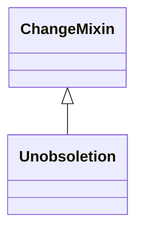

# Class: Unobsoletion
_Opposite operation of obsoletion. Rarely performed._


* __NOTE__: this is a mixin class intended to be used in combination with other classes, and not used directly


URI: [kgcl_schema:Unobsoletion](https://w3id.org/kgcl-schema/Unobsoletion)





## Inheritance
* [ChangeMixin](ChangeMixin.md)
    * **Unobsoletion**


## Slots

| Name | Cardinality and Range  | Description  |
| ---  | ---  | --- |


## Usages


## Identifier and Mapping Information


### Schema Source


* from schema: https://w3id.org/hrshdhgd/kgcl-schema


## Mappings

| Mapping Type | Mapped Value |
| ---  | ---  |
| self | ['kgcl_schema:Unobsoletion'] |
| native | ['kgcl_schema:Unobsoletion'] |


## LinkML Specification

<!-- TODO: investigate https://stackoverflow.com/questions/37606292/how-to-create-tabbed-code-blocks-in-mkdocs-or-sphinx -->

### Direct

<details>
```yaml
name: unobsoletion
description: Opposite operation of obsoletion. Rarely performed.
from_schema: https://w3id.org/hrshdhgd/kgcl-schema
see_also:
- http://wiki.geneontology.org/index.php/Restoring_an_Obsolete_Ontology_Term
rank: 1000
is_a: change mixin
mixin: true
slot_usage:
  has undo:
    name: has undo
    range: obsoletion

```
</details>

### Induced

<details>
```yaml
name: unobsoletion
description: Opposite operation of obsoletion. Rarely performed.
from_schema: https://w3id.org/hrshdhgd/kgcl-schema
see_also:
- http://wiki.geneontology.org/index.php/Restoring_an_Obsolete_Ontology_Term
rank: 1000
is_a: change mixin
mixin: true
slot_usage:
  has undo:
    name: has undo
    range: obsoletion

```
</details>